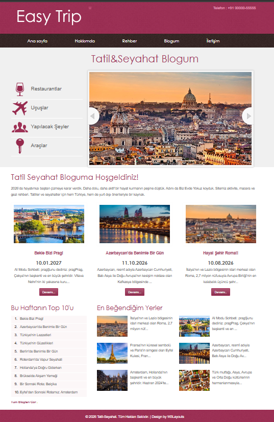
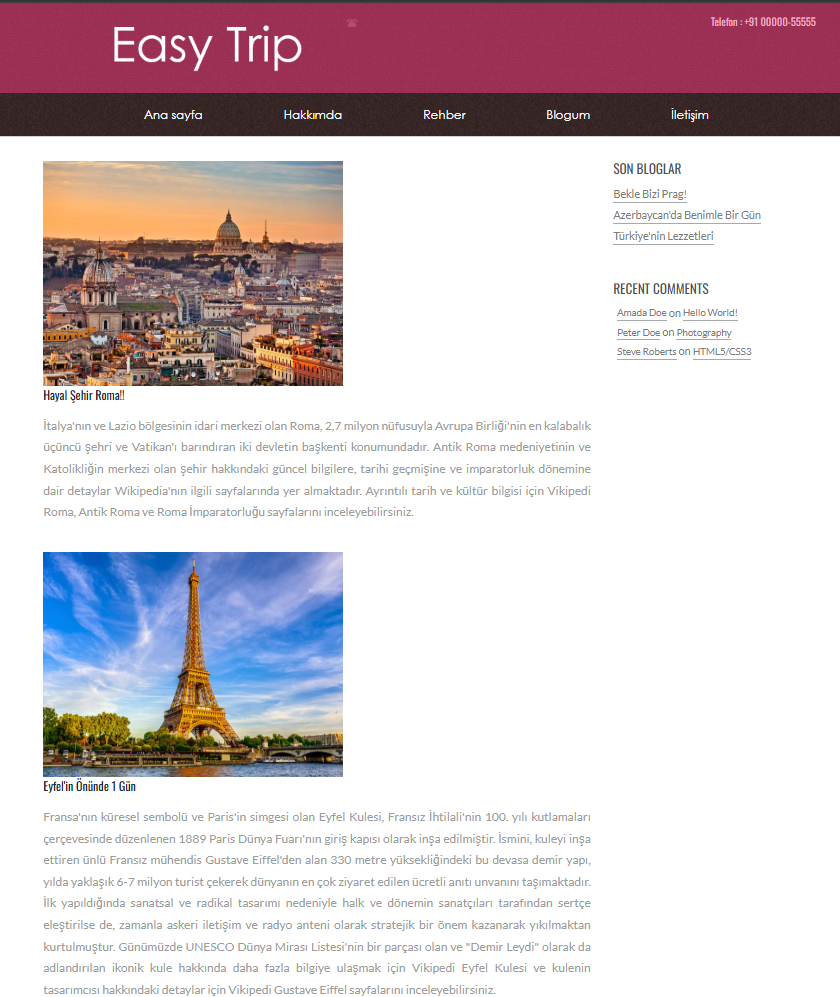
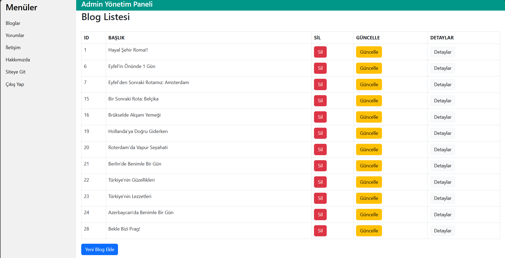

# 🌍 TravelTripProje

TravelTripProje, ASP.NET MVC kullanılarak geliştirilmiş bir seyahat blogu uygulamasıdır. Kullanıcılar blog yazılarını görüntüleyebilir, yönetici paneli üzerinden içerikleri yönetebilir.

## 📷 Proje Görselleri

<h3>Ana Sayfa</h3>


<h3>Blog Sayfası</h3>


<h3>Admin Paneli</h3>



## ⚙️ Kurulum

1. Projeyi klonlayın.

```bash
git clone https://github.com/yaren-bakar/TravelTripProje.git
```

2. Visual Studio ile açın.

3. SQL Server bağlantı bilgilerini **Web.config** dosyasında düzenleyin.

4. Veritabanını oluşturun.

5. Projeyi çalıştırın.

---
